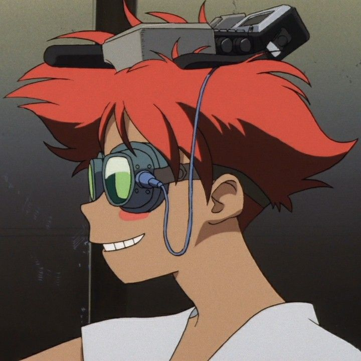
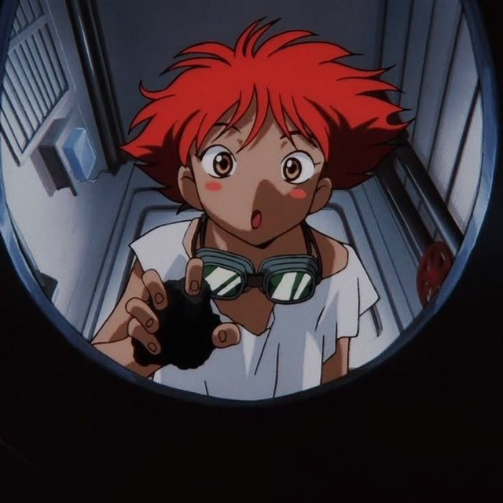

<table align="center" width="100%" bgcolor="#000000" style="border: 2px solid #33cc66; font-family: monospace; color: #33cc66; border-collapse: collapse;">
  <tr bgcolor="#051a08">
    <td colspan="2" style="border-bottom: 2px solid #33cc66; padding: 12px; font-family: monospace;">
      <table width="100%" style="border: none; border-collapse: collapse;">
        <tr style="border: none;">
          <td align="left" style="border: none;"><b>⚠️ WEYLAND-AW CORP</b></td>
          <td align="center" style="border: none;"><b>PLANETS AFFAIRS DATABASE</b></td>
          <td align="right" style="border: none; vertical-align: middle;"></td>
        </tr>
      </table>
    </td>
  </tr>
  <tr>
    <!-- Profile Info -->
    <td width="55%" valign="top" style="padding: 20px; font-family: monospace; line-height: 1.6; border-right: 2px solid #33cc66;">
      <b>CITIZEN ID: DV4</b>
       
      ----------------------------------------
       
      <b>NAME:</b> Rimuwu (WARE, WYNDHAM FORREST) 
      <b>DEPT:</b> SALVAGE (DEVELOPMENT & DESIGN) 
      <b>STATUS:</b> ACTIVE
        
      <b>DATE OF BIRTH:</b> 7 FEB 2101 
      <b>BIRTH PLACE:</b> MARS 
        
      <b>SYSTEM LOGS / OBJECTIVES:</b> 
      > 🎌 Japan Enthusiast: Passionate about Japanese culture, history, and aesthetics. 
      > 💻 Developer Journey: Started with bots, now building mods, websites, games, and high-load apps. 
      > 🦖 What about now: Designing and developing custom independent software.
    </td>
    <!-- Photos -->
    <td width="45%" align="center" valign="top" style="padding: 20px;">
      
      

        
        
      

       
      <b>SUBJECT BIOMETRIC IMAGES</b>
    </td>
  </tr>
  <!-- Section: Tech Stack Header -->
  <tr bgcolor="#051a08" style="border-top: 2px solid #33cc66; border-bottom: 2px solid #33cc66;">
    <td colspan="2" style="padding: 10px; font-family: monospace;">
      <b>[ ACTIVE MODULES & TOOLKITS ]</b>
    </td>
  </tr>
  <!-- Content: Tech Stack -->
  <tr>
    <td colspan="2" style="padding: 20px; font-family: monospace;">
      
      
      
      
      
      
      
      
      
      
      
      
    </td>
  </tr>
  <!-- Section: Stats Header -->
  <tr bgcolor="#051a08" style="border-top: 2px solid #33cc66; border-bottom: 2px solid #33cc66;">
    <td colspan="2" style="padding: 10px; font-family: monospace;">
      <b>[ BIOMETRIC METRICS & PERFORMANCE GRAPH ]</b>
    </td>
  </tr>
  <!-- Content: Stats -->
  <tr>
    <td colspan="2" style="padding: 20px; font-family: monospace;" align="center">
      
      

        
        
      

    </td>
  </tr>
</table>
